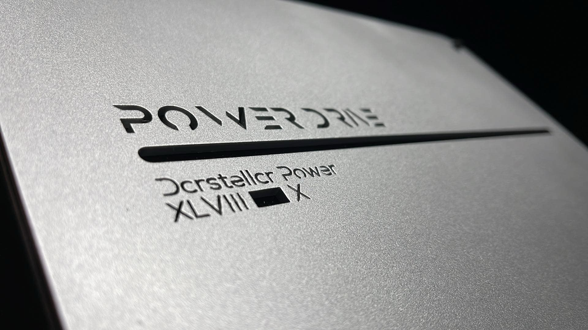
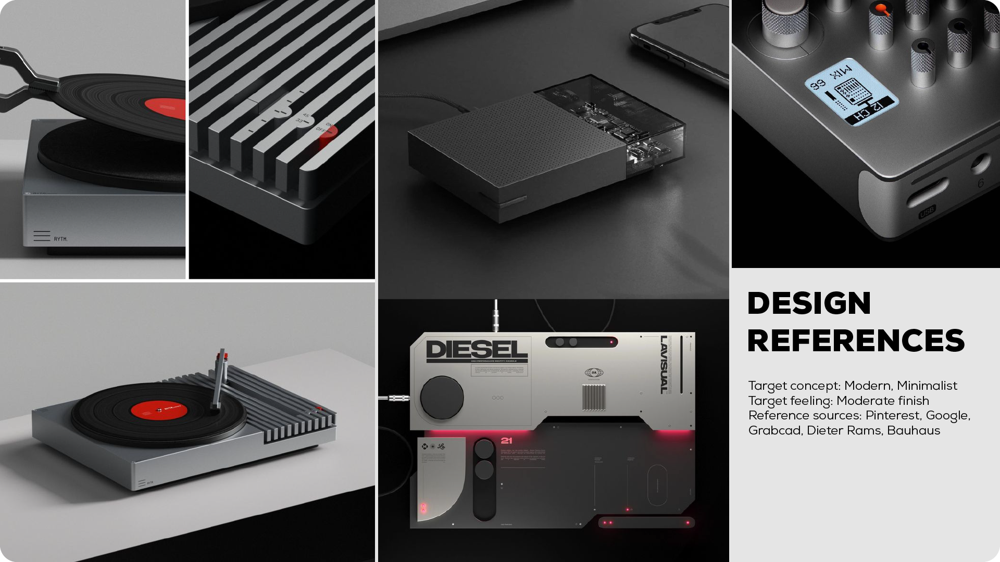
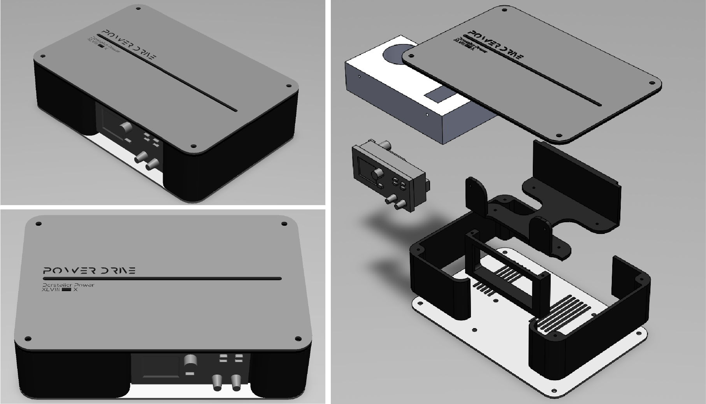
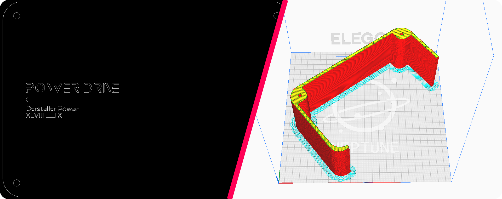
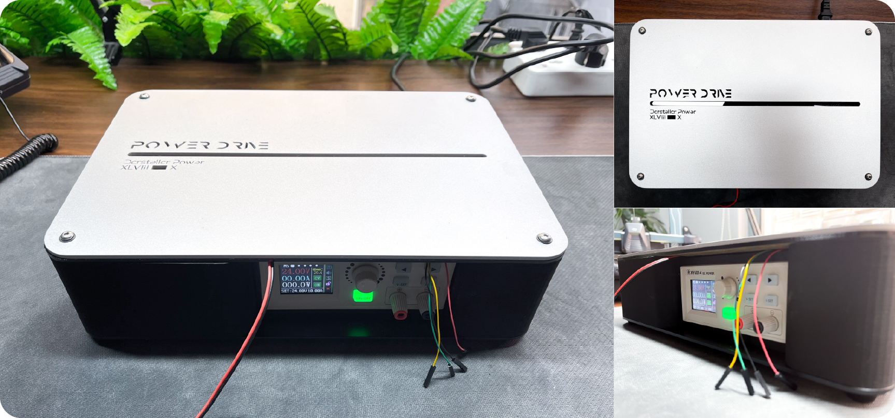

# ADJUSTABLE DC POWER SUPPLY UNIT
*My special thanks to my friend, my colleague, Trần Ngọc Duy (Lý Hoàng Duy), without whose support I couldn't have managed this project. I would also like to express my gratitude towards my colleague, my master, [Mr. Nghĩa](https://github.com/nghiank97) at Apicoo Robotics for his unparalleled knowledge of various communication systems. Thank you all for your contribution and dedication.*

***IN PROGRESS***

#
## ABOUT

As an electronics and prototyping hobbyist, the need for a power supply unit of a wide range of voltages and amperes yields that either I purchased a pre-built DC power supply, or hook up some buck-boost circuitries to a fixed one. Through market research and online shopping malls surveys, I came to the realization that pre-built DC PSUs are either too expensive or have very limited range of output. Hooking up a buck-boost converter to a fixed voltage PSU is a primitive idea yet surprisingly efficient in terms of price/performance. However, the hassle of having to get finicky with a screw driver and multimeter when manually adjusting the converter is loosely a deal breaker for this idea.

######
So I headed out to one of my friends, Trần Ngọc Duy, and was suggested a buck converter with adjusting knobs and LCD screen that could display current and set parameters. The buck converter <b><i>XY-6014</i></b> was designed for CNC machinery applications, but could be fitted to serve virtually any systems. And that was what I went for.
######
Then came the part of designing a case that provides housing for the components. The PSU is made up of a 36V DC unit, the buck converter mentioned above, an AC power inlet, a microcontroller that can read serial data from the buck converter, and write certain effects to an LED strip that I mounted underneath the PSU, mainly for aesthetic purposes.

#
## COMPONENTS
- x1 36V-10A AC-DC Power Supply Unit
- x1 XY-6014 Buck Converter
- x1 5V Regulator
- x1 STM32F103C6T6A MCU
- x17 WS2812B RGB LED
- x2 (Manufactured) 310mm x 210mm x 3mm Aluminum Plates
- x1 (Manufactured) 310mm x 210mm x 3mm Black Acrylic Panel
- x3 (Manufactured) PETG Housing Parts
- x1 AC Inlet with Switch
- x1 AC Cable

#
## MECHANICAL DESIGN

The case parts for the PSU were designed in Solidworks. Initially I aimed to 3D print them all entirely, with hope that certain geometrically creative designs could be implemented. I took some references online on Pinterest and Google, looking for innovative concepts, and have stumbled upon various designs by incredible people.

######

######

But then I asked myself the question: Do I want it to look good? Or do I want it to also feel good to the touch? And not to mention the aspect of ergonomic and friendly design. Now with reprap (3D printing), I could have manufactured virtually any shapes and forms, but it wouldn't be able to rival the quality by CNC machining, and touching plastic would feel somewhat cheaper than touching, say, aluminum or glass. So after some considerations, I decided that my prototype must have non-industrial design, meaning that it must look like it belongs to a consumer's house, on a desk, not in a factory, and the corners should be rounded (I hate sharp corners). Furthermore, it should have certain parts where touching gives a sense of high quality and finish. In the end, I arrived at the design shown below:

######

######

For manufacturing, every parts with complex form such as the side walls, the buck and AC-DC mounts were 3D printed using PETG filament. I especially increased the infill density to around 25% to achieve a tougher result. The top and bottom panels were of aluminum material, and were made by ordering local laser cutting shops in my region.

######

#####
And finally, the prototype: (Please excuse the cables, it was still in development the moment I took the pictures)

######

#
## MODBUSRTU AND WS2812B FIRMWARE

Okay, I know what you're thinking, what does Modbus RTU have to do with this amature PSU, and why even bother adding LEDs? Well, first, I like LEDs and making colors. Second, I like to make consumers-targetted products, so appearance definitely matters. Third, screw you all who say Functionalities over Aesthetics. Aesthetics is the key force that drives functionalities forward. Think of a Ford car at the very beginning of the automobile age, then think of any modern day cars: If they didn't want to imporve on the aesthetic aspect, why would you need complex CAN and LIN buses inside a thing made purely for traveling and not for entertaining or showing off purposes? I'm not saying Aesthetics over Functionalities, but in general they should be put side by side. To me, a good design has to base its functionalities around aesthetics, and the chosen aesthetics must revolve around its predetermined functionalities. Now back to fourth, the XY-6014 buck actually has a wifi module that could communicate with the base circuit through Serial using Modbus RTU. I did not, however, get the wifi version, so I have the Serial port hanging there for free doing nothing. And if it's there and I paid for it, it would be a sin not to utilize the product to its fullest.

